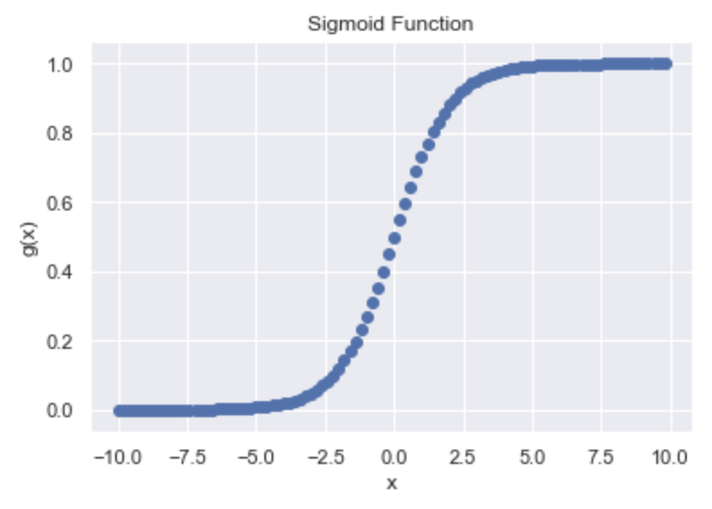

cool.

Most of this information (especially notation) comes from Stanford's CS229 lecture notes and the rest comes from Bishop's "Pattern Recognition and Machine Learning". If I skip some explanation on parts, such as maximum likelihood, you can refer to one of those resources.

At its core, logistic regression is a binary classifer. In the past, you've most likely seen regression models of the most simple case where $h(x) = \beta^TX + \beta_0$ and the model output is a *real number*. In classification problems, however, we wish to predict discrete class labels. Actually, the model output is a probability of a categorical outcome (model output value lies in [0,1]). To do this, we use a generalization of the model in which we transform the linear function of $\beta$ using a non-linear function $f(\cdot)$. In machine learning, this is called an *activation function*. 

You can think of logistic regression as predicting the outcome between two categorical variables, maybe **blue/green** or **0/1** but it won't be used to output a continuous value such as [a houseprice of $1.31M](https://sf.curbed.com/2018/9/28/17915044/home-sales-corelogic-august-2018-sf-prices-affordability)

Stated above, logistic regression outputs a **probability** of a categorical variable. That means that the output is bounded within [0,1]. Why is it bounded? Because you cannot have a -3.20% chance of success or 140% chance of failure.

How do we force our outputs to be within that 0 to 1 range? With the sigmoid function :)

Sigmoid function: $g(x) = \frac{1}{1+e^{-x}}$, with the curve:



Technically, our hypothesis equation should then be:

$$h_\theta(x) = g(\theta^Tx) = \frac{1}{1+e^{-\theta^TX}}$$

$$\text{where } g(z) = \frac{1}{1+e^{-x}}$$  
    
Now that we have our logsitic regression function, we need to learn the parameters $\theta$.

This is done through maximum likelihood. The motive behind maximum likelihood is that we should choose $\theta$ to make the data as highly probable as possible. 

$$ L(\theta) = \prod_{i=1}^m p(y^{(i)} | x^{(i)}; \theta)$$

$$ L(\theta) = \prod_{i=1}^m (h_\theta(x^{(i)}))^{y^{(i)}}(1-h_\theta(x^{(i)}))^{(1-y^{(i)})} $$

We need to **maximize** $L(\theta)$, which is difficult. Instead, we maximize any strictly increasing function of $L(\theta)$, the **log likelihood**.

$$ \ell(\theta) = log(L(\theta)) = \sum_{i=1}^{m}y^{(i)}log(h(x^{(i)})) + (1-y^{(i)})log(1-h(x^{(i)}))$$

We maximize this via gradient ascent.

Our update will be as follows (the plus sign is correct -- this is gradient ascent, remember, not gradient descent):

$$ \theta := \theta + \alpha \nabla_\theta \ell(\theta) $$

$$ \text{where } \frac{\partial}{\partial \theta_j}\ell(\theta) = (y-h_\theta(x))x_j $$ 

$$ \text{[derived in CS229 notes]} $$

So, finally:

$$ \theta := \theta + \alpha(y^{(i)}-h_\theta(x^{(i)}))x_j^{(i)}$$

```python
import numpy as np
import matplotlib.pyplot as plt


def sigmoid(x):
    return 1/(1+np.exp(-x))

def log_likelihood(features, target, weights):
    return np.sum(target*np.log(sigmoid(np.dot(features, weights))) + (1-target)*np.log(1-sigmoid(np.dot(features,weights))))

def logistic_regression(features, target, iterations, alpha, fit_intercept=True, show_weights=True):
    if fit_intercept:
        intercept = np.ones((target.shape[0], 1))
        features = np.concatenate((intercept,features), 1)
        
    m = features.shape[1]
    weights = np.zeros(m)
    for step in range(iterations):
        curr = np.dot(features, weights)
        preds = sigmoid(curr)
        
        
        error = target - preds
        gradient = np.dot(features.T, error)
        weights += alpha*gradient
        
        # show cost 
        if (step%1000) == 0:
            print(log_likelihood(features, target, weights))
            
    if show_weights:
        print("weights: {}".format(weights))
        
    return weights
```

TO DO: Update this post with some data and results.