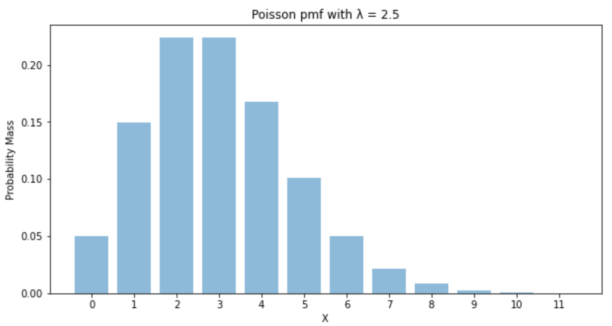

## Binomial Random Variable:
---------------------

Here's what we know:

- we have _n_ independent trials
- we have **two** possible outcomes
- the probability of success is _p_ (same for every trial)
- this makes the probability of failure as _(1-p)_ 

if _X_ represents the number of successes that occur in the _n_ trials, then _X_ is a binomial random variable with parameters _(n,p)_.

$$ P(X = x) = {n \choose x} p^x (1-p)^{n-x} $$

$$\text{where } {n \choose p} = \frac{n!}{p!n-p!} $$


**Example:**
It's known that any item produced by a certain machine will be defective with probability 0.1 (independent of any other item). What is the probability that in a sample of three items, at most one will be defective?

With _X_ as the number of defective items in the same, then _X_ is a bionomial random variable with parameters _n_ = 3 and _p_ = 0.1.

We want to know the probability that _at most one_ will be defective, that is. We want to know the summation of $P($none are defective$)$ + $P($one is defective$)$ = $P(X=0) + P(X=1)$

$$ = {3 \choose 0}(0.1)^0(0.9)^3 + {3 \choose 1}(0.1)^1(0.9)^2 = 0.972 $$

```python
import numpy as np
import math
import matplotlib.pyplot as plt

def binomial(n, p, x):
    return math.comb(n, x) * (p**x) * (1-p)**(n-x)

print(binomial(3, 0.1, 0) + binomial(3, 0.1, 1))
```
`0.9720000000000002`

## Poisson Random Variable
-----------------

Here's what we know:

- Poisson distribution describes the number of events that occur within a given time interval
- Poisson is a _discrete_ distribution, meaning the events mentioned above must be discrete and cannot be continuous
(i.e. "number of purchases" and "number of people entering a bank" are both discrete)
- $\lambda$ represents the expected number of events per time interval
- it is bounded by $0$ and $\infty$. *


Some underlying assumptions for us to remember:
- the rate at which the events occur is constant
- events are independent, meaning the occurrence of one event happening does not impact others from happening

----------

Probability Mass Function (pmf):

the probability (height) of getting each of these discrete outcomes is modeled by:

$$P(X = x) = e^{-\lambda} \frac{\lambda^x}{x!}, \text{ for } x \geq 0$$

Below is a plot to get a better understanding:

```python
import numpy as np
import math
import matplotlib.pyplot as plt

def poisson_pdf(lam, x):
    return (np.exp(-lam)*lam**x)/(math.factorial(x))

def plot_pmf(lam):    
    
    y_axis = np.array([poisson_pdf(3, x) for x in range(0,int(lam*5))])
    x_axis = [x for x in range(0,int(lam*5))]
    plt.figure(figsize=(10,5))
    plt.bar(x_axis, y_axis, align='center', alpha=0.5)
    plt.xticks(x_axis)
    plt.ylabel('Probability Mass')
    plt.xlabel('X')
    plt.title('Poisson pmf with λ = {}'.format(lam))
    plt.show();
    return

plot_pmf(2.5)
```

